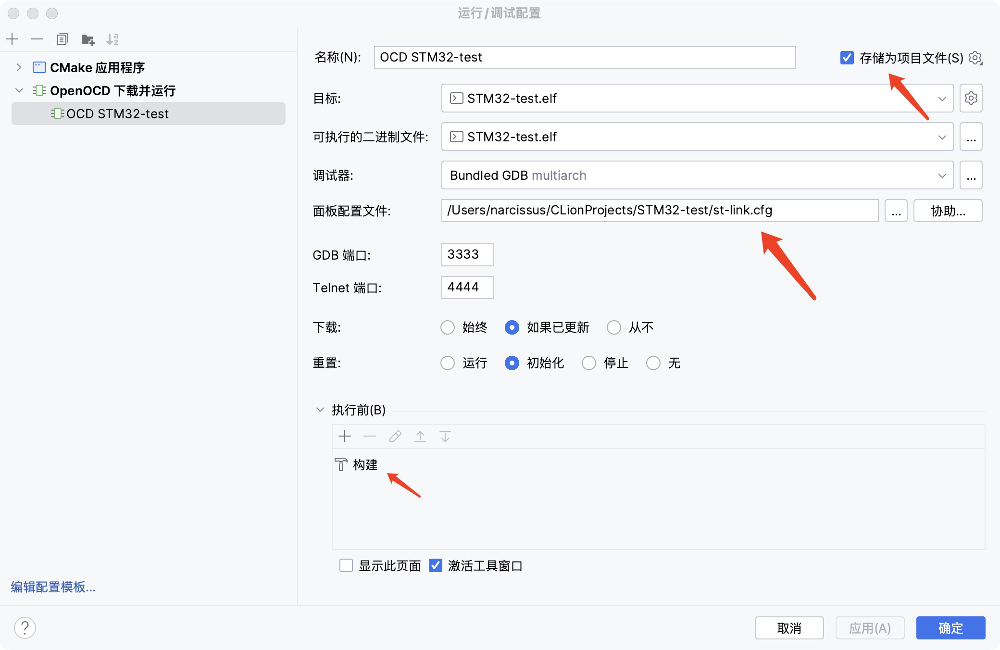
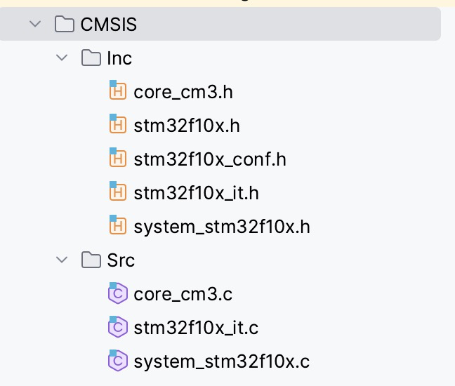

# STM32新建工程：标准库

### 1、下载对应软件

* 提前安装工具：

  ```bash
  xcode-select --install
  softwareupdate --install-rosetta
  brew install java
  ```

* arm-none-eabi-gcc：交叉编译工具链

  ```bash
  brew tap ArmMbed/homebrew-formulae
  brew install arm-none-eabi-gcc
  #安装完成后，通过以下命令查看输出，判断是否完成安装
  arm-none-eabi-gcc -v
  ```

* open-ocd：用于对STM32进行下载仿真

  ```bash
  brew install openocd
  #下载完成后
  which openocd
  #查看安装地址
  ```

* clion：IDE编辑器

  ```bash
  brew install --cask clion
  ```

  后续可用教育账号激活或是购买正版199刀首年

* STM32CubeMX：用于生成STM32工程

  [STM32CubeMX下载地址](https://www.st.com/en/development-tools/stm32cubemx.html#get-software)，下载时需要登陆ST账号。

  软件下载后，右键SetupSTM32CubeMX-6.5.0选择显示包内容，双击Contents/MacOs/SetupSTM32CubeMX-6_5_0即可进入安装界面，点击继续安装即可，安装完成后若显示软件无法打开，在系统偏好设置的安全性与隐私中允许打开该文件。

* STM32标准库模板文件

### 2、clion配置

* 下载对应插件：OpenOCD + ESP32 Support for Embedded Development

* 设置openOCD及STM32CubeMX对应位置

  打开设置，选择编辑、构建、运行，选择嵌入式开发，找到对应的openocd和STM32CubeMX地址，点击测试，可以正常运行代表无误

* 配置编译工具链以及CMake选项

### 3、文件编辑

先通过STM32CubeMX生成对应工程，注意选择对应IDE为STM32CubeIDE，然后新建配置文件，用于选择openOCD下载方式。新建文件的名称，可根据下载工具进行选择，例如：st-link.cfg，dap-link.cfg等。

新建文件到工程下之后，复制对应的内容：

```
# choose st-link
source [find interface/stlink.cfg]
source [find target/stm32f1x.cfg]
```

```
# choose dap-link
adapter driver cmsis-dap
transport select swd

# 0x10000 = 64K Flash Size
set FLASH_SIZE 0x20000

source [find target/stm32f1x.cfg]

# download speed = 10MHz
adapter speed 10000
```

编辑完成后，在openOCD的编辑界面选择对应文件：



### 4、导入标准库文件

* 删除文件夹中的Core和Drivers文件夹，需注意的是要**提前把Core中的startup文件复制出来**
* 导入标准库文件，分别存放于CMSIS和Driver文件夹下（新建），再新建User文件夹，其中新建文件main.c，并且将startup文件放入其中。Driver文件夹下主要存放标准库中的STM32F10x_StdPeriph_Driver文件夹下的文件，保持不变；而CMSIS中保存的文件如下所示：



* 至此，文件导入完成，修改CMakeLists.txt文件，将对应语句替换

```cmake
include_directories(Core/Inc Drivers/STM32F1xx_HAL_Driver/Inc Drivers/STM32F1xx_HAL_Driver/Inc/Legacy Drivers/CMSIS/Device/ST/STM32F1xx/Include Drivers/CMSIS/Include)

add_definitions(-DUSE_HAL_DRIVER -DSTM32F103xE)

file(GLOB_RECURSE SOURCES "startup/*.*" "Drivers/*.*" "Core/*.*")
```

替换为：

```cmake
include_directories(CMSIS/Inc Driver/Inc USER/Inc)

add_definitions(-DUSE_STDPERIPH_DRIVER -DSTM32F10X_LD)

file(GLOB_RECURSE SOURCES "Driver/*.*" "CMSIS/*.*" "USER/*.*")
```

并且在其中加入浮点printf支持：

```cmake
add_link_options(-specs=nano.specs -specs=nosys.specs -u _printf_float)
```

至此，STM32标准库开发环境配置完成，可尝试编译下载。
